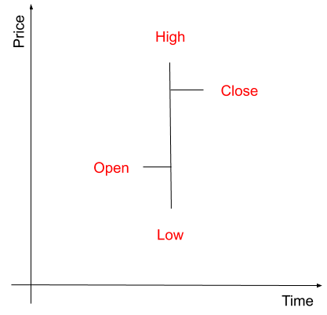

# Technical analysis

## Overview

::: tip
We learned the basics of technical analysis thanks to [Technical Analysis For Dummies](https://amzn.to/38TWaQm).
:::

### Introduction
Technical analysis (often referred to by ‘charting’, ‘market timing’, or ‘trend following’) is the study of price behavior in financial markets to forecast the next movement. The goal is to identify the market sentiment: optimistic (bullish), pessimistic (bearish), or uncertain.

The key idea is that prices move in trends most of the time. These trends can be identified with patterns you see repeatedly and with support and resistance trend lines. Primary trends (lasting months or years) are punctuated by secondary movements (lasting weeks or months) in the opposite direction of the primary trend. Trends remain in place until some significant events happen (Part of [Dow theory](https://en.wikipedia.org/wiki/Dow_theory)).

At a fundamental level, this is about drawing lines linking the troughs or the peaks to guess where things are going. Of course, what happens depends on so many things that you can’t always be right. No line could have helped at guessing the effects of the Coronavirus, but people continue to try to guess what’s next; it’s in human nature to reduce uncertainty.

Technical analysis focuses on the price of an asset rather than on its fundamentals.

### How does it look like?
On a chart, the horizontal axis is time, and the vertical axis is the price. The price is presented as a bar representing a time interval, showing :

* Open: the price at which a security first trades during that time interval.
* High: the highest price at which a stock traded during the time interval.
* Low: the lowest price at which a stock trades throughout a time interval.
* Close: the final price at which it trades for that time interval.

This is how it looks like :



After adding bars to this chart, you can draw lines to forecast future prices. For example, you can draw a line connecting the highest prices, expecting other traders will sell at this point.

### What will you try to do?
Technical analysis is the art of identifying the behavior of other traders and take advantage of it.

For example, the herd reacts to news coming, for example, from Twitter, and they start to interpret it to buy or sell an asset. This will make the price go up or down, and we will want to join the crowd to take advantage of this momentum.

### Indicators
Indicators are a way to identify and measure market sentiment without using your emotions. Their goal is to identify conditions by separating the signal from the noise.

An indicator is a line or a set of lines that you put on a chart to identify events that allows you to clarify and enhance your perception of the price move.

Assets’ prices are sometimes trending, meaning they have a “direction” during a specific period. Indicators can help you anticipate and see a trend, for example :

* A trend is beginning: Moving Average Crossover Indicator.
* A trend is strong or weak: Slope of linear regression.
* A trend is ending: Breakout pattern.
* …

_Note: Most indicators have a range of time in which research shows they work best._

Indicators give buy and sell signals, but they don’t give you a clear decision rule. There are four types of signals :

* Crossovers: one line crossing another one, for example, price crossing the resistance line. This is, most of the time, a breakout.
* Range limits: the price is nearing an extreme of its recent range. This is a warning of an overbought or oversold condition, and most of the time, a signal for an impending potential retracement or reversal.
* Convergence: two indicator lines coming closer to one another. Usually, a warning that the direction or the strength of a trend is changing.
* Divergence: two indicator lines moving farther apart. Usually, a warning that the rising price is going to stop rising.

### Managing the trade
No matter what indicators you will use, you will take losses. You also need a set of rules designating the conditions that must be met for trade entries and exits to occur.

A trading rule will instruct your bot to buy or sell on the condition a preset criterion is met (like the price moving average crossover).

Your trading plan with four rules :

* Determine whether a trend exists: choose indicators for this.
* Establish rules for opening a position: create a rule that decides when to buy.
* Manage the risk: choose if you add or remove money to the trade.
* Establish rules for closing a position: set when to close the opening position.

Our goal is to identify your tradable trends and apply your trading rules.

## Create the project

### Introduction

We are going to use [ta4j](https://ta4j.github.io/ta4j-wiki/), an open-source Java library for technical analysis. It provides the basic components for the creation, evaluation, and execution of trading strategies.

### Create your project
Type this command :

```bash
mvn -B archetype:generate -DarchetypeGroupId=tech.cassandre.trading.bot \
-DarchetypeArtifactId=cassandre-trading-bot-spring-boot-starter-basic-ta4j-archetype \
-DarchetypeVersion=CASSANDRE_LATEST_RELEASE \
-DgroupId=com.example \
-DartifactId=ta4j-strategy \
-Dversion=1.0-SNAPSHOT \
-Dpackage=com.example
```

[](https://search.maven.org/search?q=g:%22tech.cassandre.trading.bot%22%20AND%20a:%22cassandre-trading-bot-spring-boot-starter%22)

The created project is a spring boot project with the following structure :

```
ta4j-strategy/
├── pom.xml
└── src
    ├── main
    │   ├── java
    │   │   └── com
    │   │       └── example
    │   │           ├── Application.java
    │   │           ├── package-info.java
    │   │           └── SimpleTa4jStrategy.java
    │   └── resources
    │       ├── application.properties
    │       ├── user-main.tsv
    │       └── user-trade.tsv
    └── test
        ├── java
        │   └── com
        │       └── example
        │           └── SimpleTa4jStrategyTest.java
        └── resources
            ├── application.properties
            ├── tickers-btc-usdt.tsv
            ├── user-main.tsv
            └── user-trade.tsv
```

## Create your strategy

Your strategy is in `src/main/java/com/example/SimpleTa4jStrategy.java`

### Choose the requested currency pair
This is done by implementing [getRequestedCurrencyPair()](https://www.javadoc.io/doc/tech.cassandre.trading.bot/cassandre-trading-bot-spring-boot-autoconfigure/latest/tech/cassandre/trading/bot/strategy/BasicTa4jCassandreStrategy.html#getRequestedCurrencyPair%28%29) this way :

```java
@Override
public CurrencyPairDTO getRequestedCurrencyPair() {
	return new CurrencyPairDTO(BTC, USDT);
}
```

### Choose your trading account
On the exchange, you usually have several accounts, and Cassandre needs to know which one of your accounts is the trading one. To do so, you have to implement the [getTradeAccount()](https://www.javadoc.io/doc/tech.cassandre.trading.bot/cassandre-trading-bot-spring-boot-autoconfigure/latest/tech/cassandre/trading/bot/strategy/CassandreStrategyInterface.html#getTradeAccount%28java.util.Set%29) method, which gives you as a parameter the list of accounts you own, and from that list, you have to return the one you use for trading.

```java
@Override
public Optional<AccountDTO> getTradeAccount(Set<AccountDTO> accounts) {
    return accounts.stream()
                    .filter(a -> "trade".equals(a.getName()))
                    .findFirst();
}
```

### Choose the number of bars
This is done by implementing [getMaximumBarCount()](https://www.javadoc.io/doc/tech.cassandre.trading.bot/cassandre-trading-bot-spring-boot-autoconfigure/latest/tech/cassandre/trading/bot/strategy/BasicTa4jCassandreStrategy.html#getMaximumBarCount%28%29) this way :

```java
@Override
public int getMaximumBarCount() {
	return 10;
}
```

### Choose the delay between two bars
This is done by implementing [getDelayBetweenTwoBars()](https://www.javadoc.io/doc/tech.cassandre.trading.bot/cassandre-trading-bot-spring-boot-autoconfigure/latest/tech/cassandre/trading/bot/strategy/BasicTa4jCassandreStrategy.html#getDelayBetweenTwoBars%28%29) this way :

```java
@Override
public Duration getDelayBetweenTwoBars() {
    return Duration.ofDays(1);
}
```

::: tip
This method allows you, for example, to receive tickers every second but only add one to the bar every day.
:::

### Create your strategy
Now it's time to implement your strategy, and we chose [Simple Moving Average (SMA)](https://www.investopedia.com/terms/s/sma.asp) :

```java
@Override
public Strategy getStrategy() {
    ClosePriceIndicator closePrice = new ClosePriceIndicator(getSeries());
    SMAIndicator sma = new SMAIndicator(closePrice, getMaximumBarCount());
    return new BaseStrategy(new UnderIndicatorRule(sma, closePrice), new OverIndicatorRule(sma, closePrice));
}
```

## React to signals

Now that your strategy is coded, Cassandre will call your [shouldEnter()](https://www.javadoc.io/doc/tech.cassandre.trading.bot/cassandre-trading-bot-spring-boot-autoconfigure/latest/tech/cassandre/trading/bot/strategy/BasicTa4jCassandreStrategy.html#shouldEnter%28%29) method when it's time to buy and your [shouldExit()](https://www.javadoc.io/doc/tech.cassandre.trading.bot/cassandre-trading-bot-spring-boot-autoconfigure/latest/tech/cassandre/trading/bot/strategy/BasicTa4jCassandreStrategy.html#shouldExit%28%29) method when it's time to sell. You can do things manually by creating orders, but you can also use positions.

For example, you can do something like that on [shouldEnter()](https://www.javadoc.io/doc/tech.cassandre.trading.bot/cassandre-trading-bot-spring-boot-autoconfigure/latest/tech/cassandre/trading/bot/strategy/BasicTa4jCassandreStrategy.html#shouldEnter%28%29) :

```java
if (canBuy(new BigDecimal("0.01"))) {
            // Create rules.
            PositionRulesDTO rules = PositionRulesDTO
                    .builder()
                    .stopGainPercentage(10f)
                    .stopLossPercentage(5f)
                    .build();
            // Create position.
            createLongPosition(
                    new CurrencyPairDTO(BTC, USDT),
                    new BigDecimal("0.01"),
                    rules);
        }
```

Cassandre provides positions to manage your trading automatically. First, we created a rule saying this position should be closed if the gain is more than 10% or if the loss is more than 5%.

Then we called the [createLongPosition()](https://www.javadoc.io/doc/tech.cassandre.trading.bot/cassandre-trading-bot-spring-boot-autoconfigure/latest/tech/cassandre/trading/bot/strategy/GenericCassandreStrategy.html#createLongPosition%28tech.cassandre.trading.bot.dto.util.CurrencyPairDTO,java.math.BigDecimal,tech.cassandre.trading.bot.dto.position.PositionRulesDTO%29) method. It will automatically create a buy order. From now, with every ticker received, Cassandre will check the gain or loss made on this position; if it triggers one of the rules, Cassandre will automatically create a sell order to close it.

::: tip
You can learn more about positions in the [Position chapter](./position-management.md).
:::

::: tip
Inside your strategy, you can call [canBuy()](https://www.javadoc.io/doc/tech.cassandre.trading.bot/cassandre-trading-bot-spring-boot-autoconfigure/latest/tech/cassandre/trading/bot/strategy/GenericCassandreStrategy.html#canBuy%28tech.cassandre.trading.bot.dto.user.AccountDTO,tech.cassandre.trading.bot.dto.util.CurrencyPairDTO,java.math.BigDecimal%29) and [canSell()](https://www.javadoc.io/doc/tech.cassandre.trading.bot/cassandre-trading-bot-spring-boot-autoconfigure/latest/tech/cassandre/trading/bot/strategy/GenericCassandreStrategy.html#canSell%28tech.cassandre.trading.bot.dto.util.CurrencyDTO,java.math.BigDecimal%29) methods to see if your account has enough money to buy or sell assets.
:::

## Backtest your strategy

In simple words, backtesting a trading strategy is the process of testing a trading strategy on prior periods. Cassandre trading bot allows you to simulate your bots' reaction to historical data during tests.

The first step is to add [cassandre-trading-bot-spring-boot-starter-test](https://mvnrepository.com/artifact/tech.cassandre.trading.bot/cassandre-trading-bot-spring-boot-starter-test) to your project dependency.

Edit your `pom.xml` file and add :

```xml
	<dependencies>
		...
		<dependency>
			<groupId>tech.cassandre.trading.bot</groupId>
			<artifactId>cassandre-trading-bot-spring-boot-starter-test</artifactId>
			<version>CASSANDRE_LATEST_RELEASE</version>
			<scope>test</scope>
		</dependency>
		...
	</dependencies>
```

[](https://search.maven.org/search?q=g:%22tech.cassandre.trading.bot%22%20AND%20a:%22cassandre-trading-bot-spring-boot-starter%22)

The second step is to set the Cassandre parameter`cassandre.trading.bot.exchange.modes.dry` to `true`: this will make Cassandre simulate the exchange (buying/selling orders, trades) and increase/decrease your account.

Now, we need to generate the data you want to use during your JUnit tests. To do so, you can run this on the command line (on Linux) :

```bash
startDate=`date --date="3 months ago" +"%s"`
endDate=`date +"%s"`
curl -s "https://api.kucoin.com/api/v1/market/candles?type=1day&symbol=BTC-USDT&startAt=${startDate}&endAt=${endDate}" \
| jq -r -c ".data[] | @tsv" \
| tac $1 > tickers-btc-usdt.tsv
```

It will create a file named `tickers-btc-usdt.tsv` that contains the historical rate of `btc-usdt` from `startDate` (3 months ago) to `endDate` (now). Of course, you can change dates and currency pair.

Now place this file in the `src/test/resources` folder of our project and add this line to your JUnit test class:

```java
@Import(TickerFluxMock.class)
```

Now, instead of receiving tickers from the exchange, you will receive tickers imported from the `tsv/csv` files you put in `src/test/resources`.

Your test is in `src/test/java/com/SimpleTa4jStrategyTest.java`.

Now we write the tests :

```java
@Test
@DisplayName("Check gains")
public void gainTest() {
        System.out.println("Cumulated gains:");
        gains.forEach((currency, gain) -> System.out.println(currency + " : " + gain.getAmount()));

        System.out.println("Position still opened :");
        strategy.getPositions()
                .values()
                .stream()
                .filter(p -> p.getStatus().equals(OPENED))
                .forEach(p -> System.out.println(" - " + p.getDescription()));

        assertTrue(gains.get(strategy.getRequestedCurrencyPair().getQuoteCurrency()).getPercentage() > 0);
}
```

The first thing we do with the `await()` method is to wait until all data from `btc-usdt.csv` are imported. Then, we calculate every closed position's gain, and we check that the profits are superior to zero.

The last thing we do is display the list of open positions to see if there are things to improve.
